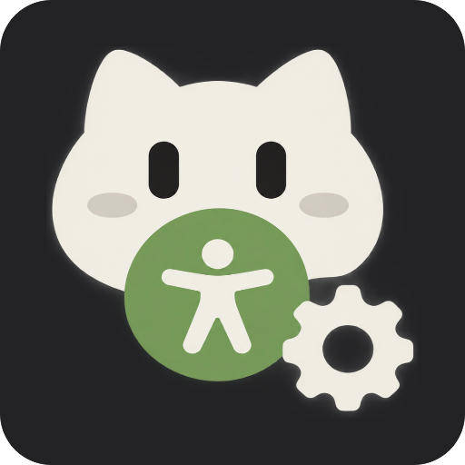

<div align="center">



# AccessHub · 无障碍管家

**用 Shizuku / Sui 一键管理所有无障碍服务，无需进入层层设置**

[](LICENSE)
[](#环境要求)
[](#技术栈)
[](#技术栈)
[](https://shizuku.rikka.app/)
[](https://github.com/RikkaApps/Sui)
[](#界面)

[](https://github.com/Shimmerfly/AccessHub/stargazers)
[](https://github.com/Shimmerfly/AccessHub/network/members)
[](https://github.com/Shimmerfly/AccessHub/issues)
[](https://github.com/Shimmerfly/AccessHub/actions/workflows/android.yml)
[](https://github.com/Shimmerfly/AccessHub/releases)

</div>

AccessHub 是一个通过 **[Shizuku](https://shizuku.rikka.app/) / [Sui](https://github.com/RikkaApps/Sui)**
以 Shell 权限读写系统无障碍服务列表的 Android 应用。
通过把散落在「设置 → 无障碍 → 已安装的服务」里的开关集中到一屏，一键自动启用 / 禁用任意服务，让你每次使用某无障碍功能的时候不需要再去打开它。

> [!CAUTION]
> 无障碍服务权限极高（可读取屏幕内容并代为操作），请务必只为信任的服务开启!

> [!NOTE]
> 本项目完全由 AI 生成，无人工，纯 AI（）
>
> 未识别到人脸 2333 

---

## 项目结构

[](https://gitdiagram.com/shimmerfly/accesshub?utm_source=readme&utm_medium=picture)


```stucture
app/src/main/
├── aidl/dev/sol/accesshub/shizuku/
│   └── IShellService.aidl              # 特权进程里的执行器接口（exec / destroy）
├── java/dev/sol/accesshub/
│   ├── AccessHubApp.kt                 # Application：初始化 Shizuku 监听、网络客户端
│   ├── data/
│   │   ├── ServiceMeta.kt              # 无障碍服务数据模型
│   │   └── repository/
│   │       ├── AccessibilityRepository.kt  # 枚举服务、读取与写入启用集合
│   │       └── SettingsRepository*.kt      # 设置项持久化
│   ├── permission/                     # 运行时权限（通知 / 存储 / 电池白名单…）
│   ├── shizuku/
│   │   ├── ShizukuStatus.kt            # 状态模型 + 提供方（Shizuku / Sui）
│   │   ├── ShizukuManager.kt           # binder / 授权监听，暴露 StateFlow
│   │   ├── ShizukuShell.kt             # 绑定 UserService 并执行 shell
│   │   └── ShellUserService.kt         # 跑在 shell(uid 2000) 里的实现
│   └── ui/
│       ├── MainActivity.kt             # 入口：三页 Pager + 底栏 / 侧栏
│       ├── navigation3/                # Navigation 3 路由与 Navigator
│       ├── screen/
│       │   ├── home/                   # 主页：KSU 风格状态页（Miuix / Material 双实现）
│       │   ├── accessibility/          # 服务页：列表 + 开关（双实现）
│       │   ├── settings/               # 设置页
│       │   ├── about/ colorpalette/ permission/
│       ├── component/                  # 底栏、对话框、miuix / material 组件、模糊与液态玻璃
│       ├── theme/ util/ viewmodel/
└── res/                                # 字符串（中 / 英）、主题、图标、多语言资源
```

---

## Star History

[](https://star-history.com/#Shimmerfly/AccessHub&Date)

---

## 致谢

- [tiann/KernelSU](https://github.com/tiann/KernelSU) —— UI/UX 设计参考
- [RikkaApps/Shizuku](https://github.com/RikkaApps/Shizuku) 与 [RikkaApps/Sui](https://github.com/RikkaApps/Sui) —— 特权接口

---

## 许可协议

[GNU General Public License v3.0](LICENSE)
